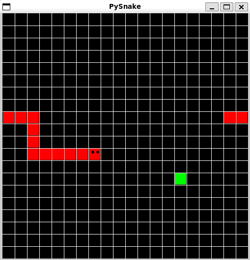

# PySnake



## Instructions

PySnake is a simple snake game implemented in Python. The objective of the game is to control the snake to eat the food and grow in length without colliding with the walls or itself.

### Controls
- **Arrow Keys**: Use the arrow keys to control the direction of the snake (Up, Down, Left, Right).

### How to Play
1. Launch the game by following the instructions below.
2. Use the arrow keys to navigate the snake.
3. Eat the food to grow longer.
4. Avoid colliding with the walls or the snake's own body.
5. The game ends if the snake collides with the walls or itself.

## How to Start the Game

1. **Clone the Repository**:
    ```sh
    git clone https://github.com/yourusername/PySnake.git
    ```
2. **Navigate to the Project Directory**:
    ```sh
    cd PySnake
    ```
3. **Install the Required Dependencies**:
    ```sh
    pip install -r requirements.txt
    ```
4. **Run the Game**:
    ```sh
    python main.py
    ```

**Note**: Make sure you have Python installed on your system. And make sure you have tkinter installed globally on your system. If not, you can install it using the following command:
```sh
sudo apt-get install python3-tk
```

but if you are using Windows, you can install it using the following command:
```sh
pip install tk
```

Enjoy playing PySnake!